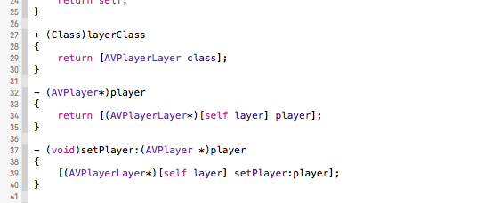
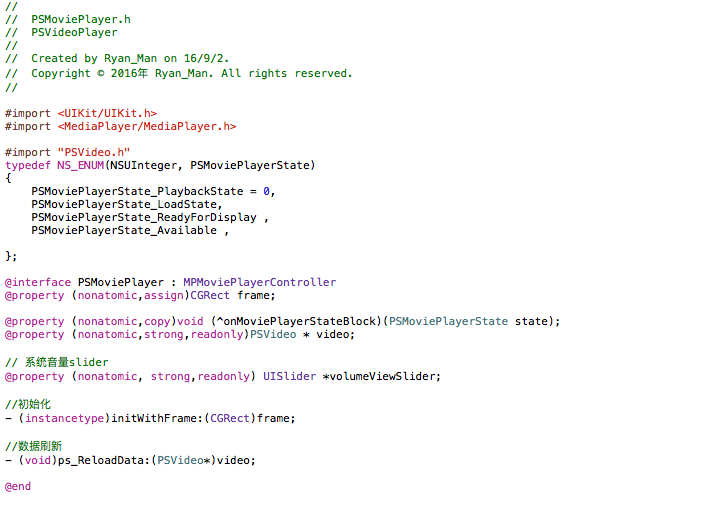
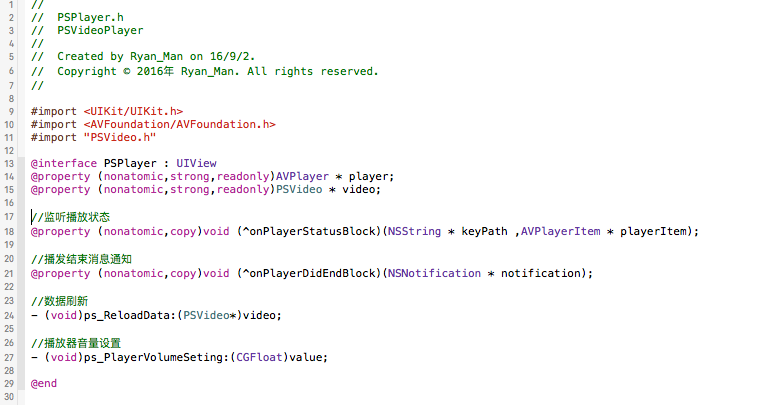
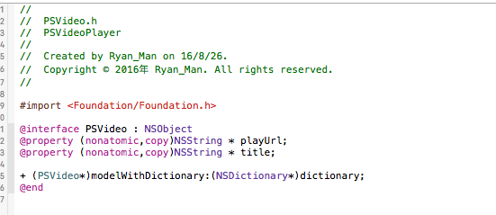
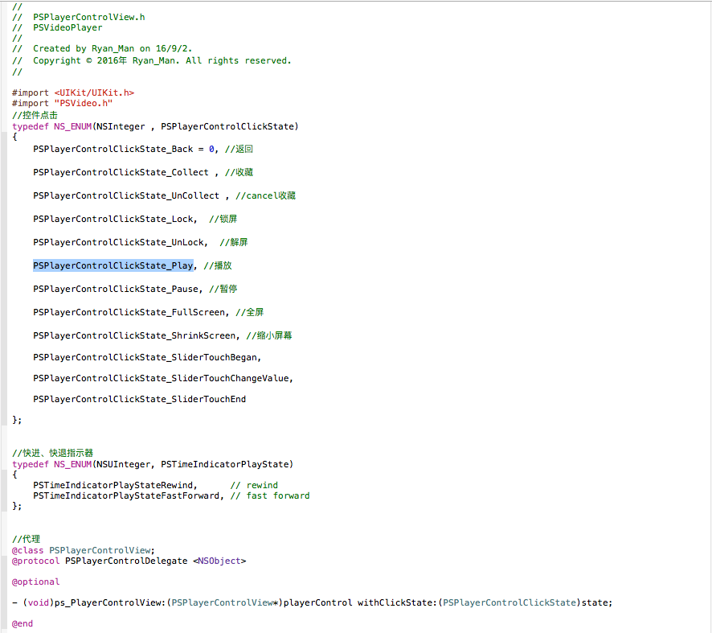
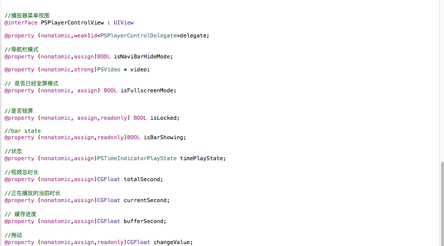

## iOS 视频播放器

> iOS系统 两种处理视频的框架 1.`<MediaPlayer/MediaPlayer.h>` 2.`<AVFoundation/AVFoundation.h>`

#### 一、`<MediaPlayer/MediaPlayer.h>`

##### 1.MPMoviePlayerController  (iOS 2.0 ~ 9.0)

  在iOS中播放视频，可以使用`MPMoviePlayerController `类来完成，该类具备一般的播放器控制功能，例如播放、暂停、停止等。但是其自身并不是一个完整的视频的视图控制器，而是继承于`NSObject`的一个对象。如果要在UI中展现视频需将`其view属性`添加到界面中。
 
 
 
##### 2. MPMoviePlayerViewController  (iOS 2.0 ~ 9.0)
  
  `MPMoviePlayerViewController`继承于`UIViewController`，默认是全屏模式展示、弹出后自动播放、作为模态窗口展示时,如果点击“Done”按钮会自动退出模态窗口等。
   
 
  
#### 二、 `<AVFoundation/AVFoundation.h>`
 
##### 1. AVPlayer

  `AVPlayer`本身并不能显示视频，而且它也不像`MPMoviePlayerController` 有一个view的属性。如果`AVPlayer`要显示必须创建一个播放器层`AVPlayerLayer`用于展示，播放器层继承于`CALayer`，有了AVPlayerLayer之添加到控制器视图的layer中即可。
  

 
#### 附录

注：如果需要自定义播放器的样式，可以选择`MPMoviePlayerController `和`AVPlayer ` 进行拓展，在此很显然`MPMoviePlayerViewController ` 已经不是适合使用了。但对于更好的选择，建议使用 `AVPlayer `，可以更好的兼容以及满足需求，毕竟在 "iOS系统9.0"之后`MPMoviePlayerController `已然弃用了。

##  PSVideoPlayer 

> 使用`MPMoviePlayerController `和`AVPlayer `这两种不同方式对视频播放器自定义样式的实现。同时结合现在iOS app开发过程中比较常见的两种UI模式 ：1. 单独视频显示 ； 2. 和UITableView 列表的结合

####功能：

1. 播放器功能: 播放 ，暂停，快进，后退。
2. 功能拓展: 全屏显示，原屏显示，亮度调节，音量调节，锁屏，收藏等

#### 注：将播放器 和 功能菜单进行分离，各自形成一个个体对象，可以单独使用 ，互不干扰。

####播放器：

##### 1.PSMoviePlayer  (播放器对象 iOS 2.0 ~ 9.0)

##### 2.PSPlayer (播放器对象)

##### 3.PSVideo (视频对象) 

##### 4.PSPlayerControlView (功能菜单) 

#### Demo 地址：`https://github.com/RyanMans/PSVideoPlayer`